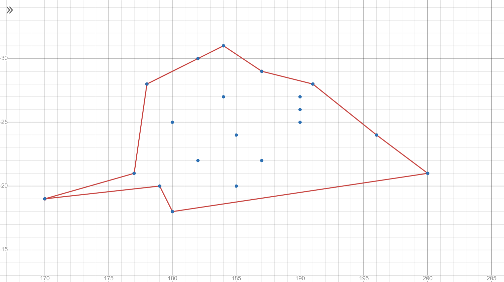

# ConvexHullClassifier
 
ConvexHullClassifier is a program written in Python that takes a data set and a query (a point) and checks if the point is inside or outside the data cluster. It essentially classifies the new point as inside or outside the data cluster. Being inside means it is similar to the data set and "belongs" in it.

It works with 2D and 3D data but also with multidimensional data. The only restriction to dimension size is computing power.

To achieve this result, it calculates a convex hull for the data set and checks if the query point is inside the convex hull.
We imagine that a data point is a point in n-dimensional space, where n is the dimension of the point (how many attributes it has, which now become coordinates in this space). The convex hull of the data set is the geometric "shape" that contains all points (usually a hyperplane, meaning, a plane with 1 dimension less than the ambient space)

To visualize this mechanism, we will imagine this simplified scenario. We want to check if a new athlete has a better chance at becoming a professional, and we assume that age and height are relevant data to us. We chose 2 parameters for explanation purposes, because an athlete will become a 2-dimensional point in a 2-dimensional ambient space (a simple graph/plane), so we will ignore the fact that this is irrelevant in reality. We take a list of professional athletes, we plot them in the graph, and we draw the tightest polygon that contains all of the professionals. Then, we check if the new athlete is inside or outside the polygon.

Visualization of a small data set for our example. 

This mechanism can be extended to any dimension. If we consider that we have 3 relevant attributes for a professional athlete, every athlete will become a point in a 3D space. If we consider 4 attributes, we are in 4D and so on. After 3D, it becomes impossible to visualize.

This program supports calculation of multidimensional convex hulls and classification of multidimensional data points. It contains as example a data set of customers of a company, with 6 attributes, meaning that each customer will be a point in a 6D space.

Binaries are available in "dist" folder.
Python packages used: tkinter, scipy, numpy

The executable loads data from the relative path "data/sample_data.txt". In the sample_data.txt file, each line must contain one data point, and there must be a newline at the end. Lines beginning with '#' are comments.

